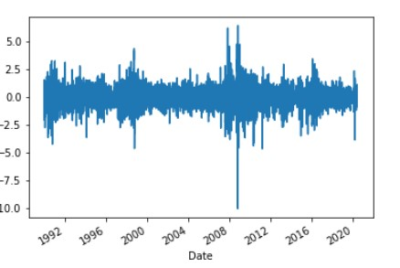

## Time Series Analysis :
#### Steps Involved :
1. importing required libraries and dependencies.
2. importing data in a format that is required for this analysis.
3. Preparing the data and decomposing it using Hodrick prescott filter to seperate trend and noise.
4. Forecasting returns using ARMA Model.
5. Forecasting the price using ARIMA Model.
5. Forecasting Volatility with GARCH.
#### Conclusions :
1. With the help of Hodrick Prescott filter , noise was seperated from trend of data. It is clear that their is indeed an element of trend exhibited by the price action. It is evident from the following visualizations :

2. Summary of ARMA model suggests that this model is not suitable for the current data.However, based on this model following reurns can be forecasted.

3. ARIMA was the used to forecast the price.

4. The final step is to analyze and forecast volatility using GARCH.

## Regression Analysis :
#### Steps Involved:
1. importing required libraries and dependencies.
2. importing data in a format that is required for this analysis.
3. Data preperation for the model to work on.
4. Splitting the data for training the model and then testing it.
5. Forecasting using the Linear Regression Model.
6. Comparing the Out-of-Sample and In-Sample performance of the model.
#### Visualization of the outcomes of this model.

